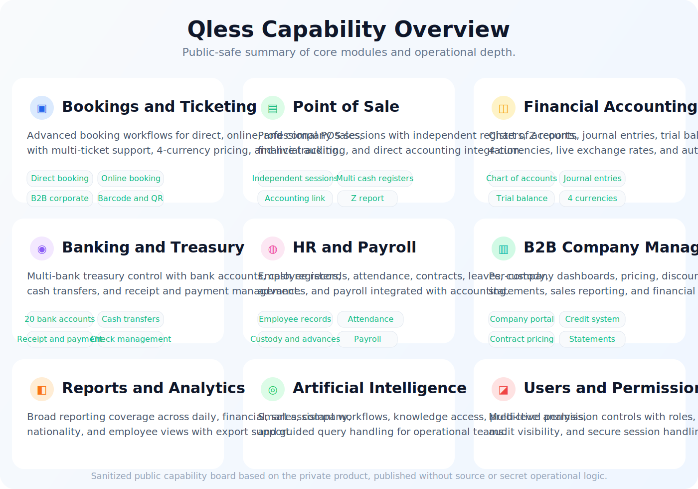

# Benthium Showcase

Benthium is a modular business platform designed for dive centers and marine activity operators. This public showcase repository presents the product at a high level under the Hostinium company identity without exposing private source code, internal workflows, or sensitive configuration.

It also acts as a safe public entry point into the wider Hostinium product portfolio.

## Product Positioning

Benthium combines operations, booking, diver records, fleet workflows, inventory, HR, reporting, and tenant-aware business management into one platform.

The product is built to support organizations that need a structured internal system rather than a simple demo dashboard.

## Hostinium Portfolio Snapshot

Hostinium maintains multiple private products. Public presentation stays at the product-summary level only.

| Product | Public Summary | Visibility |
| --- | --- | --- |
| **Benthium** | Operations platform for bookings, operational control, resources, and reporting | Private source |
| **CaptureXPro** | Structured document capture and processing application | Private source |
| **qless** | Queue, booking, and point-of-sale platform for service-led venues | Private source |
| **DrPure Platform** | Managed web and digital delivery platform for a service business | Private source |

## Featured Product Visuals

### Qless

Public-safe visual summaries based on real Qless screens:

More context: [docs/QLess.md](docs/QLess.md)

## Core Capabilities

- booking and reception workflows
- diver and customer records
- course and certification processes
- fleet, charter, and onboard operations
- inventory, cylinders, compressors, and supplies
- payroll, staff, and branch workflows
- reporting, auditability, and role-based access
- multilingual product experience with RTL support

## Technology Summary

- Backend: Laravel 11
- Frontend: Nuxt 3 + TypeScript
- Auth: Sanctum
- State: Pinia
- UI: Tailwind CSS
- Product model: modular, API-driven, multi-tenant oriented

## Why This Project Stands Out

- broad operational domain coverage
- modular backend architecture
- full-stack Laravel and Nuxt integration
- SaaS and tenant-aware product thinking
- product scope based on real business workflows

## Showcase Scope

This repository is intentionally public-facing and documentation-focused.

It does not include:

- production secrets
- internal environment files
- sensitive business data
- the private working source repository
- proprietary operational logic
- implementation details that would make the products easy to replicate

## Visual Direction

The showcase now includes sanitized public visuals for Qless. Additional product visuals can be added using the same approach: high-level presentation only, no secrets, no source exposure, and no proprietary operational detail.

## Status

Private source repository maintained separately.
Public showcase prepared for company and product presentation.
Related Hostinium products are represented publicly only through short portfolio summaries.
