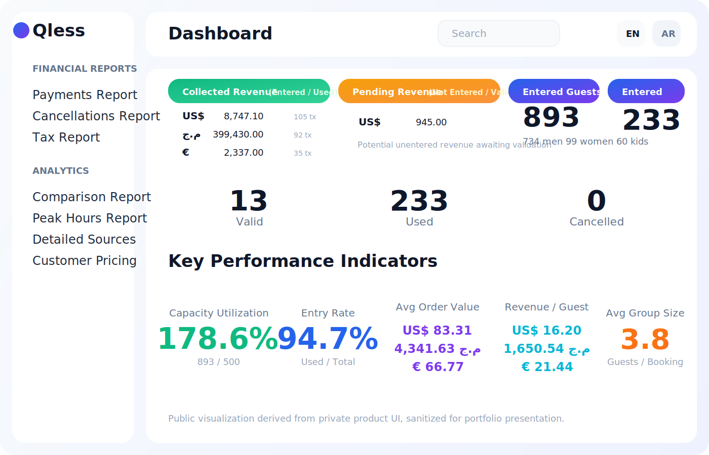
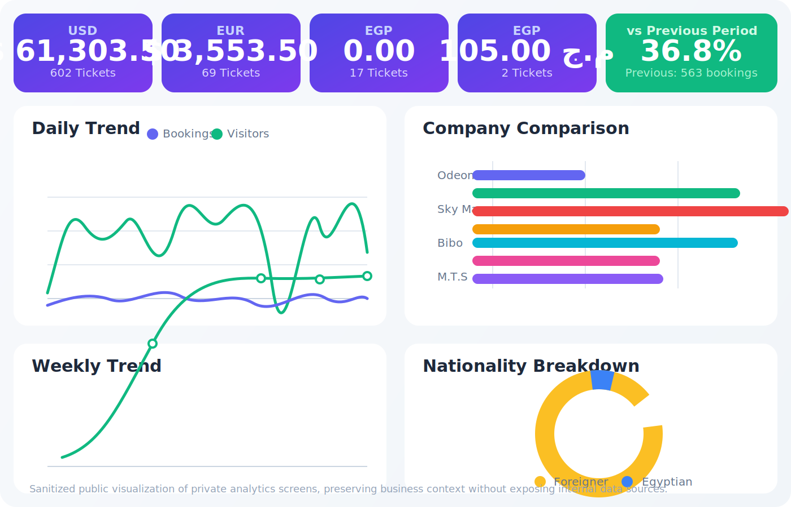
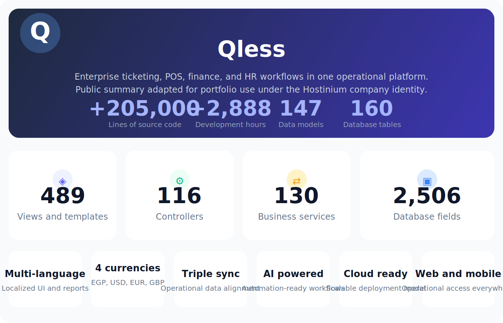

# Qless

Qless is part of the Hostinium private product portfolio. This page presents the product in a public-safe format using sanitized visual summaries derived from real product interfaces.

## Product Summary

Qless is designed for high-throughput service operations that need one system for queue flow, ticketing, bookings, point-of-sale activity, analytics, and operational reporting.

## Public Visual Snapshot

### Operations Dashboard

### Analytics Overview

### Platform Summary

## What The Public View Intentionally Shows

- multi-currency reporting and commercial summaries
- trend analysis and company comparison views
- queue and visitor flow visibility
- platform breadth at a product-summary level

## What The Public View Intentionally Hides

- production source code
- internal algorithms and pricing logic
- customer or tenant data
- deployment details and infrastructure secrets
- implementation details that would make replication easy

## Position In The Hostinium Portfolio

Qless is presented publicly as a mature service-operations product while the actual working repository remains private.